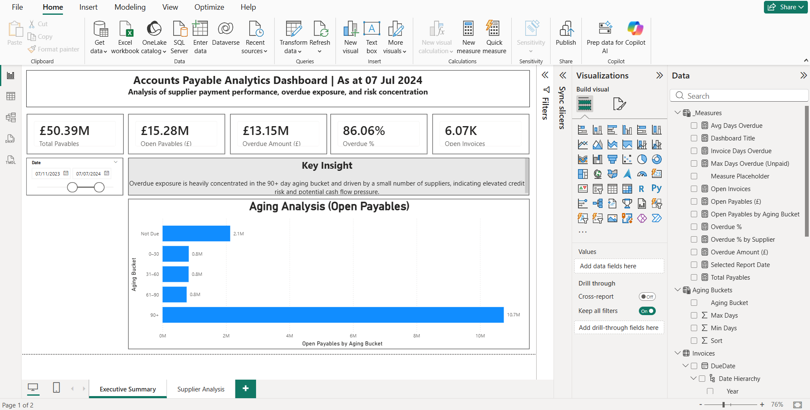
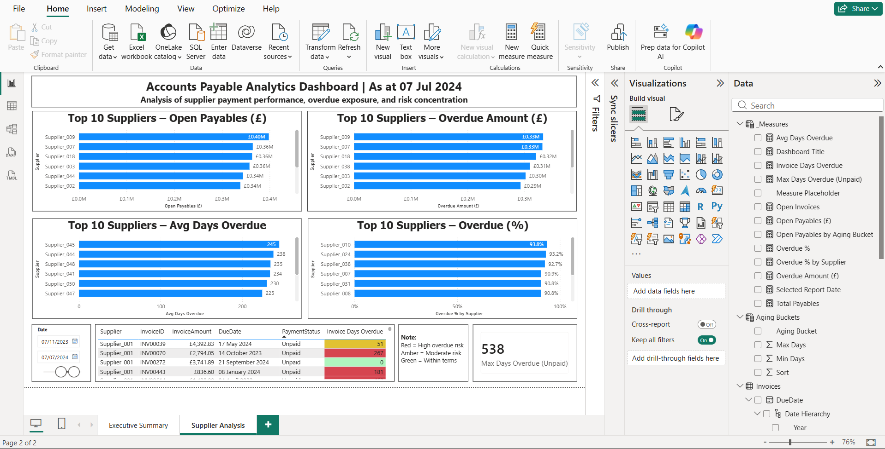

# Accounts Payable Analytics Dashboard (Power BI)

An interactive Power BI dashboard designed to analyse Accounts Payable performance, overdue exposure, supplier concentration risk, and invoice aging trends.

---

## Business Problem

Accounts payable teams require clear visibility into overdue supplier balances, payment exposure, aging concentration, and supplier risk in order to support effective cash flow management and operational decision-making.

Many finance teams struggle with:
- limited visibility into overdue invoices
- supplier concentration risk
- delayed payment monitoring
- aging analysis reporting
- manual AP tracking processes

This project was developed to address these challenges using interactive Power BI reporting and financial analytics.

---

## Solution

This Power BI solution was developed to provide finance teams with interactive visibility into supplier liabilities, overdue exposure, and payment performance.

The dashboard enables users to:
- monitor open payables
- identify overdue balances
- analyse aging trends
- detect supplier concentration risk
- investigate invoice-level detail
- support data-driven Accounts Payable decision-making

---

## Key Features

### Executive Summary Dashboard

- Total Payables KPI
- Open Payables KPI
- Overdue Amount KPI
- Overdue % KPI
- Open Invoices KPI
- Aging Analysis by Bucket
- Dynamic reporting date slicer
- Management insight commentary

### Supplier Analysis Dashboard

- Top 10 Suppliers by Open Payables
- Top 10 Suppliers by Overdue Amount
- Top 10 Suppliers by Average Days Overdue
- Top 10 Suppliers by Overdue %
- Invoice-level drill-down table
- Conditional formatting for overdue risk
- Supplier concentration analysis

---

## Business Insights

Key findings from the analysis include:

- Significant overdue exposure concentrated in the 90+ day aging bucket
- Supplier concentration risk among a relatively small number of vendors
- High overdue percentages indicating potential cash flow pressure and payment control issues
- Several suppliers demonstrating consistently high average overdue days

---

## Tools & Technologies

- Microsoft Power BI
- DAX (Data Analysis Expressions)
- Power Query
- Excel
- Data Modelling
- Interactive Data Visualisation

---

## Skills Demonstrated

- Accounts Payable Analytics
- Financial Reporting
- KPI Design
- Aging Analysis
- Supplier Risk Analysis
- Dashboard Design
- Data Visualisation
- Business Insight Communication
- DAX Measure Development
- Data Modelling

---

## Data Source

This project uses a simulated Accounts Payable invoice dataset containing:
- supplier invoices
- invoice amounts
- due dates
- payment statuses
- aging information
- supplier payment exposure data

The dataset was used solely for dashboard development, analytical modelling, and portfolio demonstration purposes.

---

## Repository Structure

```text
accounts-payable-analytics-dashboard/
│
├── PBIX/
├── Data/
├── Screenshots/
└── Exports/
```

---

## Dashboard Screenshots

### Executive Summary Dashboard



### Supplier Analysis Dashboard



---

## Future Improvements

Potential future enhancements include:

- Payment trend analysis
- Cash flow forecasting
- Supplier segmentation
- Dynamic supplier risk scoring
- Drill-through invoice investigation pages
- Automated refresh using Power BI Service
- Payment performance benchmarking
- Advanced DAX optimisation

---

## Author

Nwabueze Odimokwu

Accounting | Finance | Data Analytics

Skills & Technologies:

Power BI • DAX • Excel • Sage 50c • SQL • Python • ACCA
